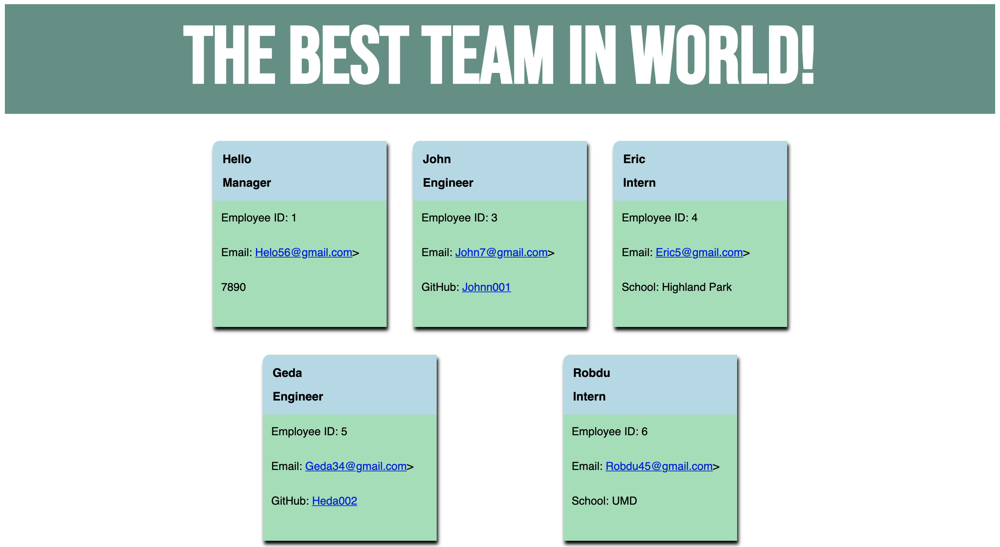

This Node CLI builds a team-displaying HTML file for a user based on their input. The user inputs a team name, a how many members will be on their team and what their roles will be, and the program generates a static page organizing their information.

images:

The generated HTML page:

Testing
This program was build using class syntax and constructor functions. The function for each employee type was tested before building out the rest of the program.

